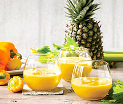

# PostCSS Image Data

[PostCSS](https://github.com/postcss/postcss) plugin for using image width, height, ratio and colour data in your CSS.


## Features

* Image width and height
* Image size ratio (width:height and height:width)
* Average colour

**Note:** All width, height and ratio helpers include a 2x resolution version. For example, `image-width()` becomes `image-width-2x()`. The assumption is that


## Usage

```.js
const postcssImageData = require('postcss-image-data');

postcss([postcssImageData([options])])
```


## CSS Example

```.css
/* Input */
.example-image {
    width: image-width('src/images/example.jpg');
}

/* Output */
.example-image {
    width: 200px;
}
```


## Available CSS helper reference examples

**Important**: All image paths used in CSS must be passed as absolute from the root of your project.

All examples below use the following image.



width1x:125
"height1x":106
"width2x":250
"height2x":211
"widthRatio1x":117.9245
"widthRatio2x":118.4834
"heightRatio1x":84.8
"heightRatio2x":84.4
"colour":"#cbbc8e"}

| Method | Input | Output | Description |
| - | - | - | - |
| `image-width()` | `image-width('test/juice.jpg')` | `125px` | Width in pixels |
| `image-width-2x()` | `image-width-2x('test/juice.jpg')` | `250px` | Width in pixels |
| `image-width-ratio()` | `image-width-ratio('test/juice.jpg')` | `117.9245%` | Ratio of width as a percentage (4 decimal places) |
| `image-width-ratio-2x()` | `image-width-ratio-2x('test/juice.jpg')` | `118.4834%` | Ratio of width as a percentage (4 decimal places)
| `image-height()` | `image-height('test/juice.jpg')` | `106px` | Height in pixels |
| `image-height-2x()` | `image-height-2x('test/juice.jpg')` | `211px` | Height in pixels |
| `image-height-ratio()` | `image-height-ratio('test/juice.jpg')` | `84.8%` | Ratio of height as a percentage (4 decimal places)
| `image-height-ratio-2x()` | `image-height-ratio-2x('test/juice.jpg')` | `84.4%` | Ratio of height as a percentage (4 decimal places)
| `image-colour()` | `image-colour('test/juice.jpg')` | `#cbbc8e` | The average colour of the image as a HEX string |


## API

### postcssImageData([options])

#### options.globPattern

* Type: String | Array
* Default value: `'./src/images/**/*'`

Override where the plugin should look for images. Paths need to be provided as glob patterns. See [globby](https://github.com/sindresorhus/globby) for supported patterns.

#### options.cachePath

* Type: String
* Default value: `'./.cache'`

The plugin creates a cache of all image data so it doesn't have to keep
